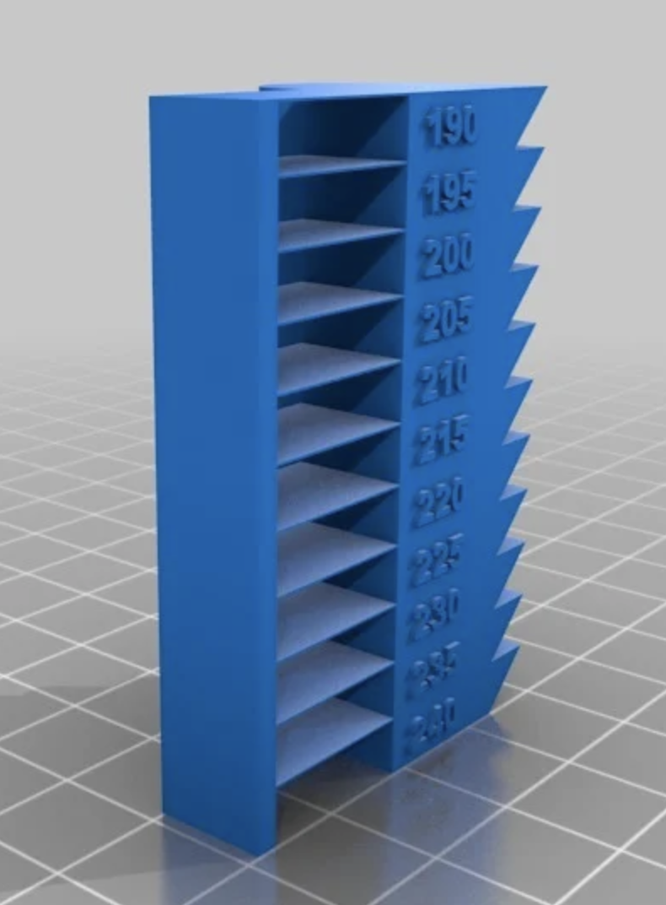
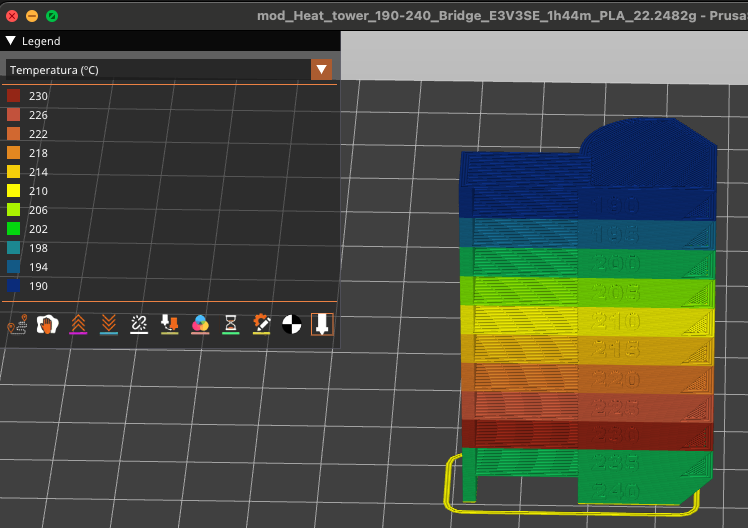

# 🧪 G-code Temperature Tower Modifier

Este script automatiza a criação de **torres de temperatura** para impressoras 3D, modificando arquivos G-code ao inserir comandos `M109` que alteram a temperatura do hotend a cada intervalo de altura definido.

Ideal para testes de qualidade de impressão com diferentes temperaturas.

---

## 📂 Estrutura do Projeto

```
├── gcode_temp_tower_batch.py
├── input_gcode/          # Coloque aqui seus arquivos G-code originais
├── output_gcodes/        # Arquivos modificados serão salvos aqui
```

---

## ⚙️ Requisitos

- Python 3.6+
- Terminal/Shell (Windows, Linux, macOS)

---

## 🚀 Como Usar

1. **Crie as pastas necessárias**:

   ```bash
   mkdir input_gcode
   mkdir output_gcodes
   ```

2. **Coloque seus arquivos `.gcode` dentro da pasta `input_gcode/`**.

3. **Execute o script**:

   ```bash
   python main.py
   ```

4. **Parâmetros opcionais**:

   Você pode personalizar os valores de temperatura e altura com os seguintes argumentos:

   ```bash
   python gcode_temp_tower_batch.py \
     --temp_inicial 240 \
     --temp_final 190 \
     --step_mm 5
   ```

---

## 🔧 O que o script faz?

- Lê todos os arquivos `.gcode` da pasta `input_gcode/`.
- Para cada incremento de altura (`Z`) de `step_mm`, insere o comando:

  ```gcode
  ; ===== ALTERANDO PARA 230C =====
  M109 S230
  ```

- Salva os arquivos modificados na pasta `output_gcodes/` com o prefixo `mod_`.

---

## 📌 Exemplo de Resultado

```gcode
G1 X50.0 Y50.0 Z5.0 F3000.0
; ===== ALTERANDO PARA 235C =====
M109 S235
G1 X60.0 Y50.0 Z5.2 F3000.0
```

## Modelo Torre de temperatura:




- [Modelo](https://www.thingiverse.com/thing:2223651)

Torre de aquecimento (190-240 °C). Com ou sem teste de ponte.

O Teaching Tech tem um ótimo vídeo mostrando este produto: [https://youtu.be/3yIebnVjADM?t=266](https://youtu.be/3yIebnVjADM?t=266)

O DoogieRick também postou um vídeo com este produto.
[https://youtu.be/FPumsgvBt00](https://youtu.be/FPumsgvBt00)

**Configurações de impressão:**

* **Rafts:** Não
* **Suportes:** Não
* **Preenchimento:** 10%
* **Observações:** Defina a temperatura base para 240 °C e incrementos de -5 °C a cada 5 mm. O Script usa como padrão este modelo e estas configurações.


---

## 📤 Contribuindo

Pull requests são bem-vindos! Sinta-se à vontade para sugerir melhorias como:

- Suporte a alteração da mesa (`M140`)
- Interface gráfica (GUI)
- Integração com OctoPrint

---

## 📄 Licença

Este projeto é open-source e disponível sob a licença MIT.
